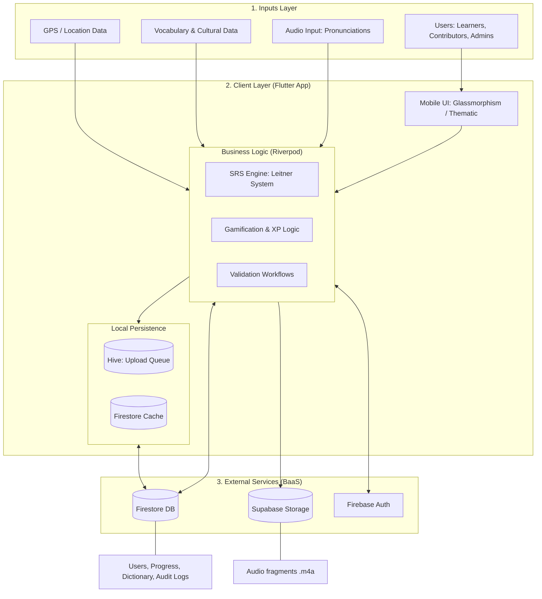

# System Architecture Diagram

This document illustrates the technical architecture of Lumad Lingua, detailing the flow from user input to external persistence.

## 🏗️ Visual Architecture (Mermaid)

## 🧩 Component Breakdown

### 1. Inputs Layer
*   **Users**: Multiple roles (Learner, Contributor, Educator, Validator, Admin) with distinct permission sets.
*   **GPS / Location**: Captured during recording to map indigenous fragments to specific Davao regions/municipalities.
*   **Audio Input**: High-fidelity recordings captured via the `record` package for cultural preservation.

### 2. Client Layer (Mobile Application)
Unlike the original diagram, the "Server" logic is decentralized into the Flutter application for better offline performance:
*   **SRS Engine**: Resides in `srs_service.dart`. It computes the next review interval for vocabulary.
*   **Local Persistence (Hive)**: Acts as a buffer. If a user contributes a word while in a remote area without signal, the entry is stored in a Hive-based **Upload Queue** and synced automatically when connectivity returns.
*   **State Management**: Riverpod handles the reactive data flow between services and the UI.

### 3. External Layer
*   **Firebase Firestore**: The primary source of truth. Stores document versions, user XP, leaderboard rankings, and the validated dictionary.
*   **Supabase Storage**: Chosen for its robust handling of media assets. All `.m4a` audio fragments contributed by the community are stored here, with signed URLs stored in Firestore.
*   **Firebase Auth**: Manages secure identity and role-based access control (RBAC).

## 🔄 Data Flow Summary
1.  **Submission**: A Contributor records a word (Audio + Metadata).
2.  **Processing**: The app attaches GPS metadata and checks the local **Upload Queue**.
3.  **Storage**: The audio file is pushed to **Supabase Storage**; the metadata is pushed to **Firestore** as a `pending` status.
4.  **Validation**: A Validator reviews the entry in the `ValidatorEntriesScreen`.
5.  **Activation**: Upon approval, Firestore triggers (via transaction) award XP to the contributor and move the word to the public `dictionary` stream.
