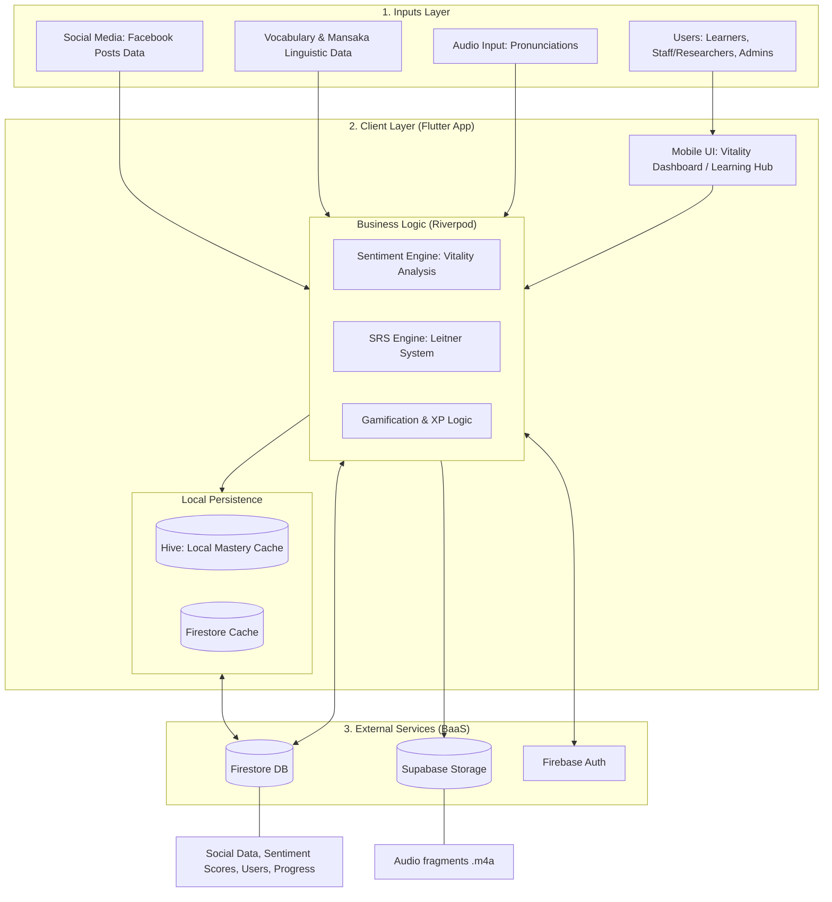

# System Architecture Diagram: Sentiment-Driven Pivot

This document illustrates the technical architecture of Lumad Lingua, detailing the flow from social sentiment data to cultural vitality monitoring.

## 🏗️ Visual Architecture (Mermaid)

## 🧩 Component Breakdown

### 1. Inputs Layer
*   **Users**: Consolidated roles (Learner, Staff/Researcher, Educator, Admin) with direct management access for Researchers.
*   **Social Data**: Monitoring of Mansaka language usage in digital spaces (Facebook) to track cultural vitality.
*   **Audio Input**: High-fidelity recordings captured via the `record` package for pronunciation practice.

### 2. Client Layer (Mobile Application)
The application logic has shifted from geographic mapping to sentiment analysis:
*   **Sentiment Engine**: Resides in `sentiment_service.dart`. It processes social media data to calculate the "Digital Vitality Index" for the Mansaka language.
*   **SRS Engine**: Computes mastery levels and review intervals for vocabulary retention.
*   **Local Persistence (Hive)**: Caches user progress and mastery data for seamless performance.
*   **State Management**: Riverpod handles reactive data flow, ensuring the Vitality Monitor stays updated with real-time sentiment trends.

### 3. External Layer
*   **Firebase Firestore**: Stores user profiles, progress, dictionary entries, and the `Social_Sentiment_Data` collection.
*   **Supabase Storage**: Managed hosting for media assets, primarily Mansaka audio recordings and cultural images.
*   **Firebase Auth**: Secure role-based access control (RBAC).

## 🔄 Data Flow Summary
1.  **Collection**: Sentiment data is harvested from digital spaces where Mansaka is used.
2.  **Analysis**: The `SentimentService` calculates scores (Positive/Neutral/Negative) based on keyword detection and usage frequency.
3.  **Visualization**: The "Sentiment Trend" dashboard replaces the legacy heatmap, showing the Mansaka language's vitality over time.
4.  **Contribution**: Researchers add vocabulary and audio directly to Firestore without a "pending" gate, accelerating dictionary expansion.
5.  **Learning**: Users engage with Mansaka-only lessons, with progress synced between Firestore and the local app state.
